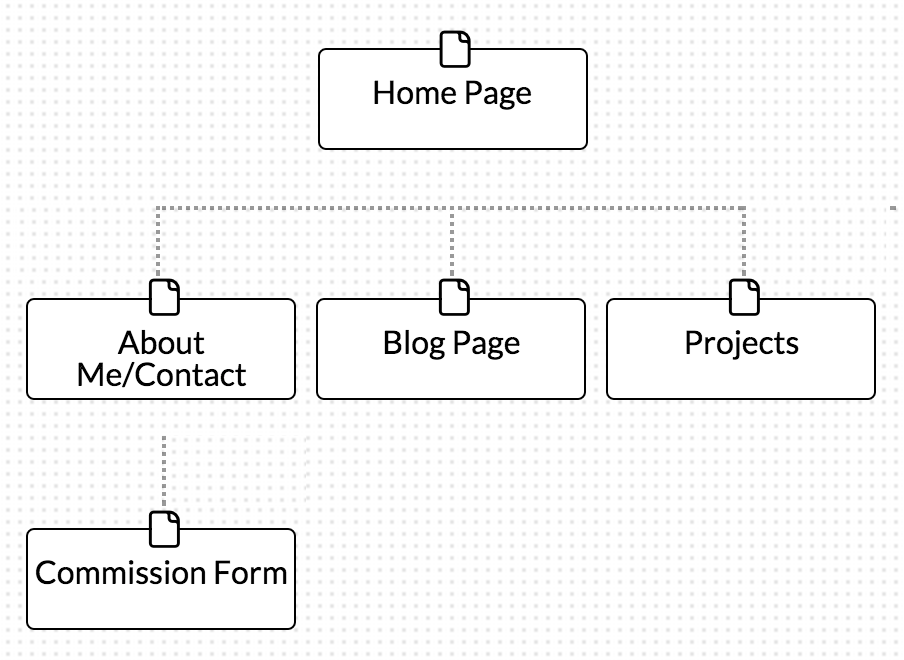

<h4>
What are the 6 Phases of Web Design?
</h4>
<ul>
<ls>
  1. Information Gathering
</ls>
<ls>
  2. Planning
  </ls>
<ls>
  3. Design
  </ls>
<ls>
  4. Development
  </ls>
<ls>
  5.Testing and Delivery
</ls>
<ls>
  6. Maintenance
  </ls>
<ls>
</ul>

<h4>What is your site's primary goal or purpose? What kind of content will your site feature?</h4>

 
 My site’s primary goal is draw attention to my future accomplishments as a developer and explain why I would be an asset to any team. As vain as it sounds that’s my goal.  This will also allow me to keep track of my own progression. I will feature a portfolio as well as a blog.

<h4>What is your target audience's interests and how do you see your site addressing them?</h4>

 
 I aim to capture the consideration of future contracts or employers.

<h4>What is the primary "action" the user should take when coming to your site? Do you want them to search for information, contact you, or see your portfolio? It's ok to have several actions at once, or different actions for different kinds of visitors.</h4>

  
I want visitors to see my site in this order, portfolio, (blog optional), contact/about me, then contract form.

<h4>What are the main things someone should know about design and user experience?</h4>

 
 The designer must know their target audience as well as the theme that draws accordingly. Feel and usage is just as contextual to the individual user experience.  Company logo and colors must be prevalent to stamp an identity onto the site.

<h4>What is user experience design and why is it valuable?</h4>

  
User experience or UX is the study of how the user feels when using or visiting a website, web-app, or software.  Designing towards the best UX is important when wanting to retain and attain visitors.  This may also help data mining when trying to optimize system performance.

<h4>What parts of this challange did you find tedious?</h4>

 
 None, all of the questions were designed to reaffirm the readings, and I actually used this challenge to help layout a different project.

