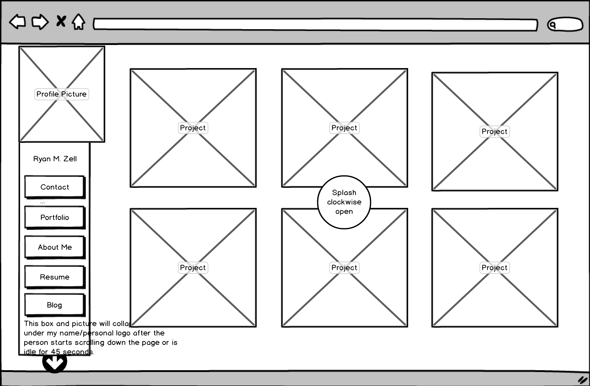

<h5> What is a wireframe? </h5>

  A wireframe is a rough draft graphical layout of what a website, mobile application, or software will look like.

<h5> What are the benifits of wireframing? </h5>

  Wireframing expresses to those involved what type of product you are trying to pitch. It also helps developers realize in which order things need to be created. The wireframe can also be UX tested slightly before the site goes into development allowing for relatively painless revision. The wireframe can also drive home your mission statement and goals.

<h5> Did you enjoy wireframing your site? </h5>

  Yes, it was nice to see a graphical representation of my index page. This will definatly make the coding process easier.

<h5> Did you revise your wireframe or stick with your first idea? </h5>

  After seeing all of the new tools I could work with I decided to scrap my old idea and start over.

<h5> What questions did you ask during this challenge? What resources did you find to help you answer them? </h5>

  I wanted to create an open drop-down menu. Eventually, I realized I was able to move objects between layers, which made it possible to show a representation. I didn't really need any outside resources, however I did research popular portfolio layouts.

<h5> Which parts of the challenge did you enjoy and which parts did you find tedious?</h5>

  I enjoyed using balsamiq, but this last question is starting to get to me.

