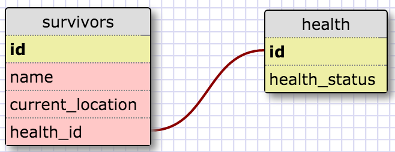

##What are databases for?

####Databases are used for managing large amounts of data. They are mainly utilized as back end storage to be accessed by overlying programming.  Examples could be user account settings or a discography search program. Database management programs make accessing this data even easier.

##What is a one-to-many relationship?

####One-to-Many speaks of the possible relationship that can occur between one parent record and the optional one or many child records.

##What is a primary key? What is a foreign key? How can you determine which is which?

####Two tables and their data columns can be selectively related to each other through the use of keys. The initial value holds the primary key to be used as the reference to call the foreign data of the second table holding the foreign key. You can only have one primary key in a table, while you can have many foreign keys.

##How can you select information out of a SQL database? What are some general guidelines for?

#### One can use many commands to select data from an SQL database. The primary commands being SELECT (insert the column here) FROM (the name of the data table).