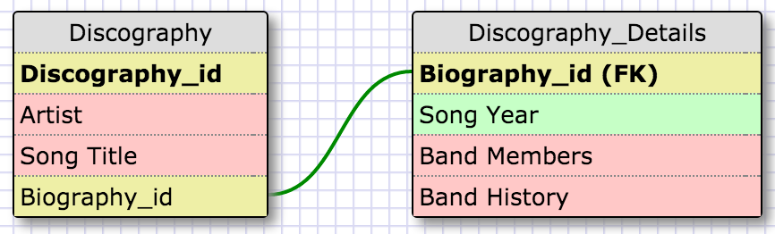

##What is a one-to-one database?
####A one-to-one database contains two categories. The first is the primarily used category, while the second is the well the secondary. The secondary contains all of the information that would only be used if more detail were needed about the first category. The link between the two is made from one id created in the first category list to all of the information in the second list.

##When would you use a one-to-one database? (Think generally, not in terms of the example you created).
####You would use a one-to-one if the secondary information were tertiary. While the first table has a surplus of information a one to one could be used to store a second table to make the first more efficient.

##What is a many-to-many database?
####A many-to-many database is a data table relationship formed by using one table full of ids to connect to many other tables full of information delineated from each primary id respectively.

##When would you use a many-to-many database? (Think generally, not in terms of the example you created).
####You would use a many-to-many database when creating a large dataset with many underlying categories.

##What is confusing about database schemas? What makes sense?
####Each database schema has its own purpose for organizational reasons. All of this is mostly straight forward to me.

